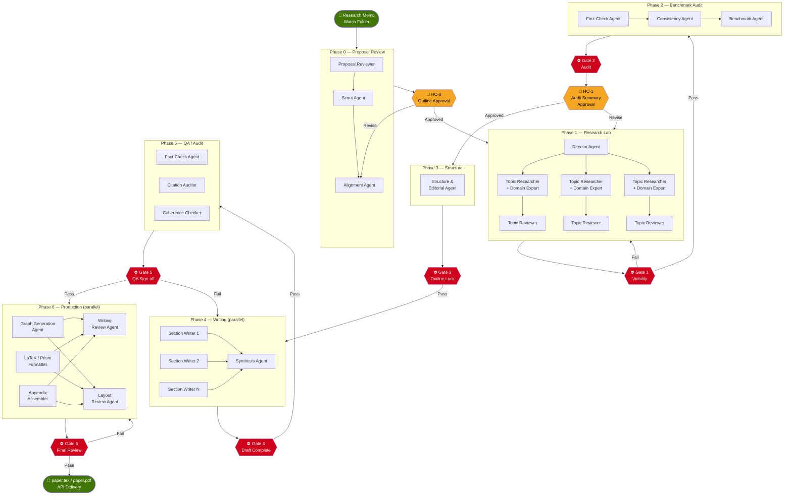
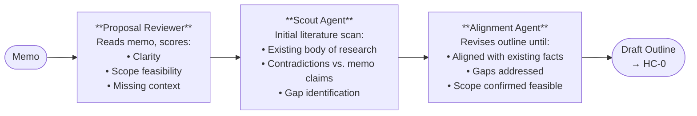
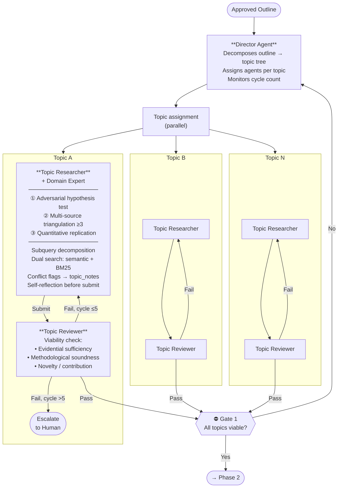
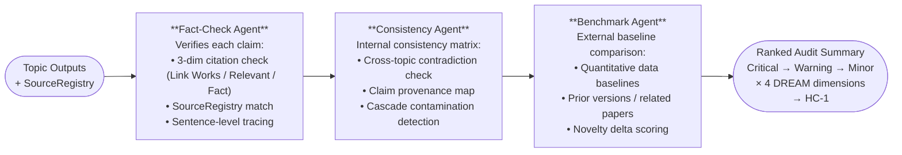
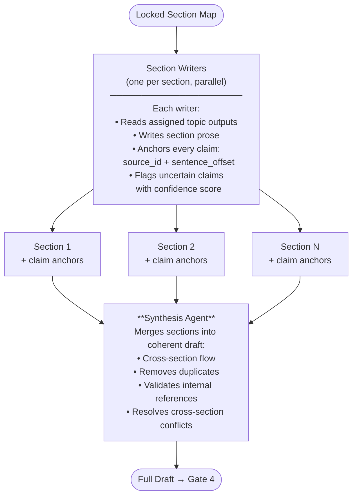
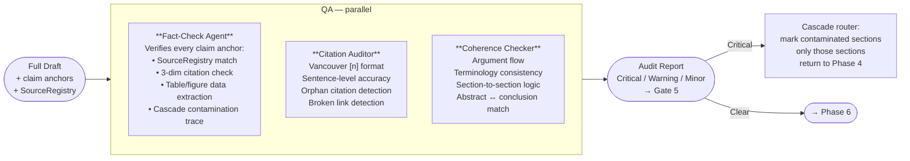
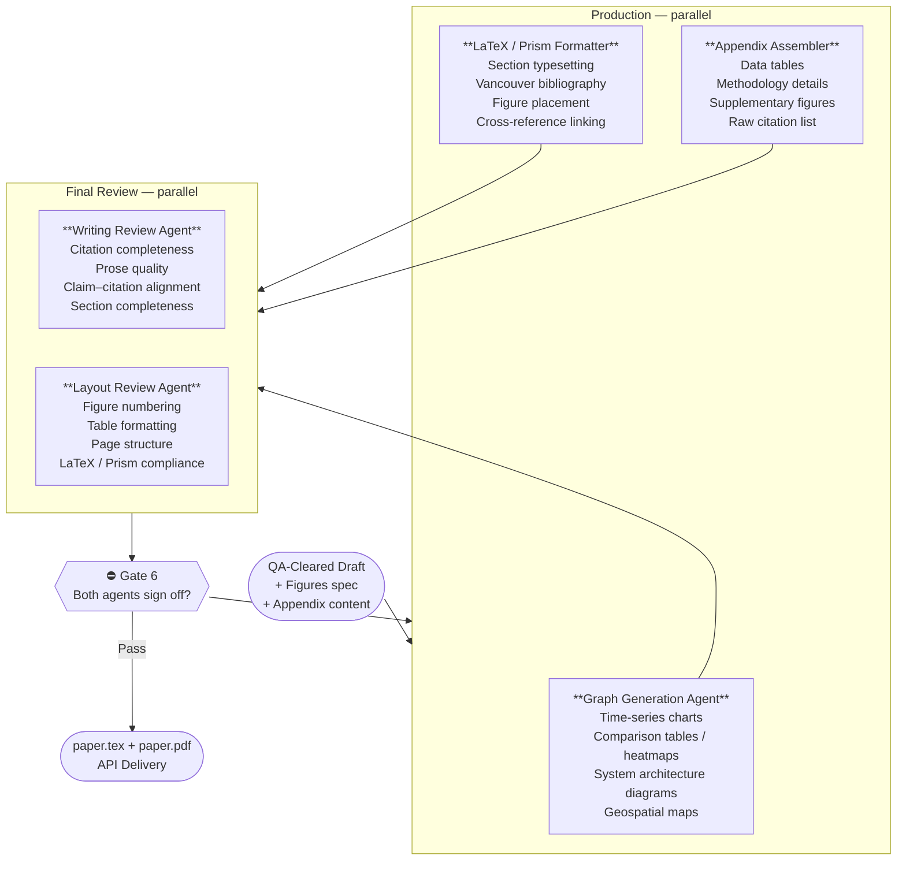

# Agentic Research Organization

A multi-agent pipeline that converts a rough research memo into a publication-grade scientific white paper — complete with Vancouver-style citations, custom figures, appendix, and LaTeX/Prism-compatible output.

---

## How It Works

A sloppy prose memo drops into a watch folder. The Director Agent orchestrates 21 fixed agents (plus dynamically spawned domain experts) through 7 sequential phases, 6 hard QA gates, and 2 human checkpoints. Nothing moves forward until the gate signs off.



---

## Phase Breakdown

### Phase 0 — Proposal Review

The system reads the memo before committing any research effort. Three agents validate it in sequence.



**Human Checkpoint 0** — Human approves or rejects the outline before any research begins. Rejection routes back to Alignment Agent.

---

### Phase 1 — Research Lab

The Director decomposes the approved outline into topics, spawns one Topic Researcher + Domain Expert per topic, and runs them in parallel. Each researcher runs three experiment types and must pass a viability check before their output is accepted.



---

### Phase 2 — Benchmark Audit

Independent of the researchers who produced the content, three audit agents verify every claim against external benchmarks and each other.



**Human Checkpoint 1** — Human reviews the ranked audit summary (most critical finding to least, scored on Presentation / Task Compliance / Analytical Depth / Source Quality). Approval unlocks writing. Rejection routes back to Phase 1 with targeted repair instructions.

---

### Phase 4 — Writing (Parallel)

Section Writers are read-only agents — no web search, no source retrieval. They compose from ResearchState only, attaching `source_id` + `sentence_offset` to every claim.



---

### Phase 5 — QA / Audit

Three agents run in parallel against the full draft. Any Critical finding blocks Gate 5 and routes only the contaminated sections (not the whole paper) back to Phase 4.



---

### Phase 6 — Production (Parallel)

All production and final review agents run in parallel. Gate 6 requires both the Writing Review Agent and Layout Review Agent to sign off.



---

## Agent Roster

| # | Agent | Division | Role |
|---|---|---|---|
| 1 | Director Agent | Command | Orchestrator — decomposes outline, assigns agents, routes failures, monitors cycle counts |
| 2 | Proposal Reviewer | Proposal | Scores memo clarity, scope feasibility, missing context |
| 3 | Scout Agent | Proposal | Initial literature scan — existing body of research, contradiction flags |
| 4 | Alignment Agent | Proposal | Revises outline until aligned with existing facts and confirmed feasible |
| 5 | Topic Researcher | Research Lab | Per-topic: subquery decomposition, dual search, 3 experiments, conflict notes |
| 6 | Domain Expert | Research Lab | Dynamically spawned per topic — specialist knowledge injection |
| 7 | Topic Reviewer | Research Lab | Per-topic viability check: evidential sufficiency, methodology, novelty |
| 8 | Fact-Check Agent (P2) | Benchmark Audit | External claim verification, SourceRegistry citation check |
| 9 | Consistency Agent | Benchmark Audit | Cross-topic contradiction, claim provenance mapping |
| 10 | Benchmark Agent | Benchmark Audit | Quantitative baseline comparison, prior-work delta scoring |
| 11 | Structure & Editorial | Structure | Locks section map, defines section assignments for writers |
| 12 | Section Writer (×N) | Writing | Per-section prose, read-only, sentence-level claim anchoring |
| 13 | Synthesis Agent | Writing | Merges parallel sections into coherent draft |
| 14 | Fact-Check Agent (P5) | QA | Draft claim verification, cascade contamination trace |
| 15 | Citation Auditor | QA | Vancouver [n] format, sentence-level accuracy, orphan detection |
| 16 | Coherence Checker | QA | Argument flow, terminology consistency, abstract ↔ conclusion match |
| 17 | Graph Generation Agent | Production | Time-series, heatmaps, architecture diagrams, geospatial maps |
| 18 | LaTeX/Prism Formatter | Production | Full typesetting, bibliography, figure placement, cross-references |
| 19 | Appendix Assembler | Production | Data tables, methodology details, supplementary figures |
| 20 | Writing Review Agent | Final Review | Citation completeness, prose quality, claim–citation alignment |
| 21 | Layout Review Agent | Final Review | Figure numbering, table formatting, LaTeX/Prism structural compliance |

Plus: dynamically spawned **Domain Experts** and **Topic Reviewers** — one pair per research topic.

---

## ResearchState Schema

All agents read and write through a single shared state object. No agent communicates with another agent directly.

```json
{
  "proposal_review": {
    "memo_text": "",
    "clarity_score": 0,
    "feasibility_score": 0,
    "missing_context": []
  },
  "scout_report": {
    "existing_body": [],
    "contradictions": [],
    "gaps": []
  },
  "refined_outline": {
    "sections": [],
    "approved_at": null,
    "approved_by": "human"
  },
  "topic_tree": {
    "topics": []
  },
  "source_registry": [
    {
      "source_id": "SR-001",
      "url": "",
      "retrieved_by": "",
      "retrieved_at": "",
      "content_hash": "",
      "raw_excerpt": ""
    }
  ],
  "topic_notes": [
    {
      "topic_id": "T-01",
      "subtopic": "",
      "partial_answer": "",
      "confidence": 0.0,
      "conflicting_sources": [],
      "conflict_resolution": "pending"
    }
  ],
  "topic_outputs": [
    {
      "topic_id": "T-01",
      "status": "pending | viable | failed | escalated",
      "cycle_count": 0,
      "content": "",
      "viability_record": {}
    }
  ],
  "claim_provenance_map": {
    "claim_id": {
      "topic_id": "",
      "source_id": "",
      "sentence_offset": 0,
      "confidence": 0.0
    }
  },
  "benchmark_report": {
    "findings": [],
    "dream_scores": {
      "presentation_quality": 0,
      "task_compliance": 0,
      "analytical_depth": 0,
      "source_quality": 0
    }
  },
  "audit_summary": {
    "critical": [],
    "warning": [],
    "minor": [],
    "approved_at": null,
    "approved_by": "human"
  },
  "section_map": {
    "sections": []
  },
  "sections": [
    {
      "section_id": "S-01",
      "title": "",
      "content": "",
      "status": "pending | draft | qa_cleared | contaminated",
      "claims": [
        {
          "claim_id": "C-001",
          "text": "",
          "source_id": "SR-001",
          "sentence_offset": 0,
          "confidence": 0.0
        }
      ]
    }
  ],
  "figures": [],
  "appendix": [],
  "phase_status": {
    "phase_0": "pending | active | complete | failed",
    "phase_1": "pending",
    "phase_2": "pending",
    "phase_3": "pending",
    "phase_4": "pending",
    "phase_5": "pending",
    "phase_6": "pending"
  },
  "escalation_log": [],
  "context_health": {
    "last_checked": null,
    "agents_over_80pct": []
  }
}
```

---

## Gate Conditions

| Gate | Condition to Pass | On Fail |
|---|---|---|
| HC-0 | Human approves refined outline | Routes back to Alignment Agent |
| Gate 1 | All topics pass viability (3 criteria) | Director routes only failing topics back to their Topic Researcher |
| Gate 2 | Benchmark Audit has zero Critical findings **or** all Criticals have approved resolutions | Routes failing topics back to Phase 1 |
| HC-1 | Human approves ranked audit summary | Director routes flagged topics back to Phase 1 with repair instructions |
| Gate 3 | Structural outline locked and complete | Routes back to Structure Agent |
| Gate 4 | All sections drafted with claim anchors | Routes incomplete sections back to Section Writers |
| Gate 5 | Zero Critical findings across all three QA agents | Cascade router returns only contaminated sections to Phase 4 |
| Gate 6 | Writing Review + Layout Review both sign off | Routes only failing components back to Production |

**Max revision cycles:** 5 per agent per phase before automatic escalation to human.

---

## Citation Standard

All citations use **Vancouver numbered inline style** `[n]`.

Citation Auditor runs a 3-dimensional check per citation:
1. **Link Works** — URL accessible, content matches expected source
2. **Relevant Content** — source topically supports the claim
3. **Fact Check** — source factually supports the exact claim text

Any citation not traceable to a `source_id` in the SourceRegistry is a Critical audit finding.

---

## Output

The pipeline delivers two files via API:
- `paper.tex` — LaTeX source, Vancouver bibliography, all figures embedded
- `paper.pdf` — compiled output

Both are compatible with **OpenAI Prism** (LaTeX-alternative scientific paper format).

---

## Stack

- **Runtime:** Claude Code subagents (Anthropic SDK, Python)
- **Orchestration:** Director Agent with shared ResearchState JSON
- **Input trigger:** Folder watch on `./input/` for `.md` / `.txt` memo files
- **Output delivery:** LaTeX/Prism file via platform API
- **Models:** Claude Opus 4.7 (Director, QA agents), Claude Sonnet 4.6 (Section Writers, production agents)

---

## Directory Structure

```
research-org/
├── README.md
├── state/
│   └── research_state_schema.json
├── agents/
│   ├── director/
│   ├── proposal/
│   │   ├── proposal_reviewer.py
│   │   ├── scout.py
│   │   └── alignment.py
│   ├── research/
│   │   ├── topic_researcher.py
│   │   ├── domain_expert.py
│   │   └── topic_reviewer.py
│   ├── audit/
│   │   ├── fact_check.py
│   │   ├── consistency.py
│   │   └── benchmark.py
│   ├── structure/
│   │   └── structure_editorial.py
│   ├── writing/
│   │   ├── section_writer.py
│   │   └── synthesis.py
│   ├── qa/
│   │   ├── fact_check_qa.py
│   │   ├── citation_auditor.py
│   │   └── coherence_checker.py
│   └── production/
│       ├── graph_generation.py
│       ├── latex_formatter.py
│       ├── appendix_assembler.py
│       ├── writing_review.py
│       └── layout_review.py
├── gates/
│   └── gate_evaluator.py
├── input/
│   └── .gitkeep
└── output/
    └── .gitkeep
```
